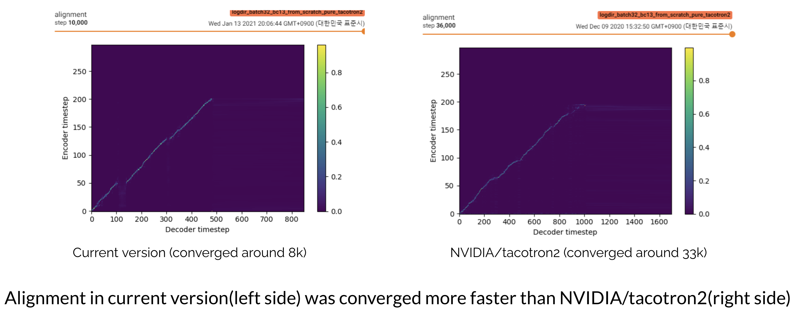
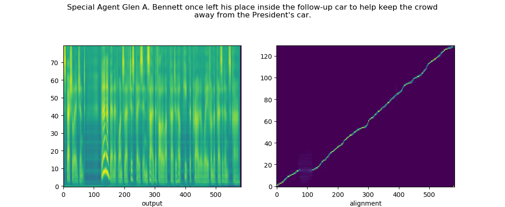
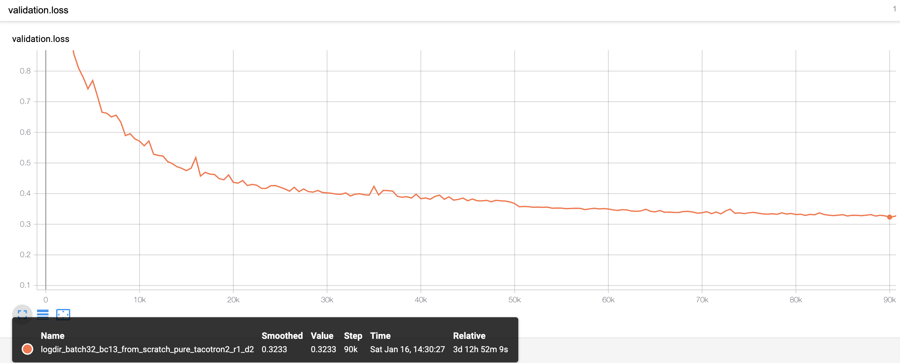
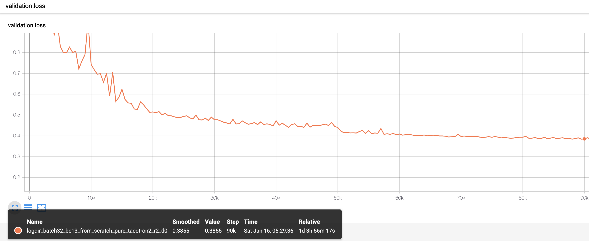

# Another PyTorch implementation of Tacotron2 MMI (with waveglow)
This is an another pytorch implementation of [Tacotron2 MMI](https://arxiv.org/abs/1909.01145) hugly based on [bfs18's code](https://github.com/bfs18/tacotron2).

## Notes
1. I decided to implement this to address robustness and slow training of [NVIDIA/tacotron2]. While I searched for issues handling it, I found [bfs18's Taoctron2 MMI](https://github.com/bfs18/tacotron2) from [issue #280](https://github.com/NVIDIA/tacotron2/issues/280) regarding to effectiveness of reduction windows in tacotron frameworks.
2. In [bfs18's Taoctron2 MMI](https://github.com/NVIDIA/tacotron2/issues/280), there are two main contributions: drop frame rate and CTC loss based MMI to maximize "the dependency between the autoregressive module and the condition module". But as reported in [the follow-up issue](https://github.com/NVIDIA/tacotron2/issues/280#issuecomment-623239923), it seems somewhat unstable. So **I didn't use MMI term** in training by setting `use_mmi==False`.
3. Instead, **I applied two things** to get robust alignments as follows.
    - `n_frames_per_step>1` mode (it is not supported in [NVIDIA/tacotron2])
    - I only tried `n_frames_per_step==2`, but it should work for any number greater than 2.
    - [espnet's implementation](https://github.com/espnet/espnet/blob/e962a3c609ad535cd7fb9649f9f9e9e0a2a27291/espnet/nets/pytorch_backend/e2e_tts_tacotron2.py#L25) of [diagonal guided attention loss](https://arxiv.org/abs/1710.08969)
4. As a result, aligments are learned more than **3 times faster** than [NVIDIA/tacotron2] with [Blizzard Challenge 2013 dataset](http://www.cstr.ed.ac.uk/projects/blizzard/)

5. However, the **overall quality of the synthesized speech is poor** even with excellent alignments due to the regularizational effects of both the drop frame rate and the reduction windows. I trained `~130k` steps, but it only shows `0.3621` val loss. This is significantly slower than NVIDIA/tacotron2 with warm start model. It may converge in later with more training, but I am not going any further in my current implementation since I don't want to spend too much time on training.

6. You can enjoy of my code, and I hope to see an exceptional improvement from you. Any suggestions are appreciated.

## Pre-requisites
1. NVIDIA GPU + CUDA cuDNN

## Setup
1. Download and extract the [Blizzard Challenge 2013 dataset](http://www.cstr.ed.ac.uk/projects/blizzard/)
2. Follow the remain process as in [NVIDIA/tacotron2]

## Training
1. `python train.py --output_directory=outdir --log_directory=logdir`
2. (OPTIONAL) `tensorboard --logdir=outdir/logdir`

## Inference
1. Single sample: `python inference.py -c checkpoint/path -r reference_audio/wav/path -t "synthesize text"`
4. Multi samples: `python inference_all.py -c checkpoint/path -r reference_audios/dir/path`

N.b.  When performing Mel-Spectrogram to Audio synthesis, make sure Tacotron 2
and the Mel decoder were trained on the same mel-spectrogram representation.

## Multi-GPU (distributed) and Automatic Mixed Precision Training
1. Not supported in current implementation.

## Suggestions and Tips
1. You may remove mel_layer in decoder to lower the training loss. It is not existing in [NVIDIA/tacotron2] but in [bfs18's code](https://github.com/bfs18/tacotron2).
2. In my experements, there was no big differences between using drop frame rate and reduction windows as described in [issue #280](https://github.com/NVIDIA/tacotron2/issues/280) especially in terms of learning alignments. But the trace of both training and validation loss are different. Specifically, using reduction windows shows more large val loss at the same training steps compared to drop frame rate. Also, training time is reduced almost by half when using reduction windows.
    - val_loss_r1_d2: val loss of using reduction windows in size 1(no reduction in frame per decoder step), and drop frame rate 0.2. 
    - val_loss_r2_d0: val loss of using reduction windows in size 2, and drop frame rate 0 (no drop frame rate).
    
3. I found another implementation from [BogiHsu](https://github.com/BogiHsu/Tacotron2-PyTorch) which also has `n_frames_per_step>1` mode. Main difference is the way to deal with the length of gate mask. You may try this too.

## Related repos
[WaveGlow](https://github.com/NVIDIA/WaveGlow) Faster than real time Flow-based
Generative Network for Speech Synthesis

[NVIDIA/tacotron2]:https://github.com/NVIDIA/tacotron2
[WaveGlow]: https://drive.google.com/file/d/1WsibBTsuRg_SF2Z6L6NFRTT-NjEy1oTx/view?usp=sharing
[pytorch 1.0]: https://github.com/pytorch/pytorch#installation
[website]: https://nv-adlr.github.io/WaveGlow
[ignored]: https://github.com/NVIDIA/tacotron2/blob/master/hparams.py#L22
[Apex]: https://github.com/nvidia/apex
[AMP]: https://github.com/NVIDIA/apex/tree/master/apex/amp
